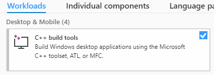
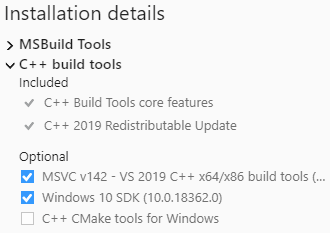

# gpu-info

This library fetches Windows GPU information not accessible through pure JavaScript.

- [Usage](#usage)
- [API](#api)
  - [API interface](#api-interface)
  - [Implemented data points](#implemented-data-points)
- [Development](#development)
  - [Prerequisites](#prerequisites)

## Usage

This library is only supported on 64-bit versions of Windows 10.

```js
const windowsGpuInfo = require('@saladtech/gpu-info');
...
```

## API

### API interface

Currently, there is no real interface defined. Once the library is called an
object with all information gets returned. The call overhead is small, thus the
library's intended use is to pull it frequently:

#### Implemented data points

It is planned to get following data points from all GPUs:

Data                            | Implemented | Win7 | Win10
---                             | ---         | ---  | ---
GPU Model                       |❌            |❌    |❌
GPU Dedicated Memory (per proc) |❌            |❌    |❌
GPU Shared Memory (per proc)    |❌            |❌    |❌
GPU Clock                       |❌            |❌    |❌
GPU Power                       |❌            |❌    |❌
GPU Mem Clock                   |❌            |❌    |❌
GPU Temp                        |❌            |❌    |❌
GPU Fan Speed                   |❌            |❌    |❌
GPU Usage                       |❌            |❌    |❌

## Development

This library can only be built on 64-bit versions of Windows 10.

### Prerequisites

Download and install the latest version of Visual Studio 2019 (the Community Edition is acceptable) or the [Build Tools for Visual Studio 2019](https://visualstudio.microsoft.com/downloads/).

In the Visual Studio Installer, ensure the "C++ build tools" workload is selected.



Additionally, ensure the latest Visual C++ compiler and Windows SDK components are selected.



Download and install the latest version of [Python 3 (64-bit)](https://www.python.org/downloads/).

TODO: Review the following:

```shell
# Driver kit Import path in 'C:/Program Files (x86)/Windows Kits/10/Include/10.0.17763.0/km'
choco install windowsdriverkit10 --version 10.0.17763
```
